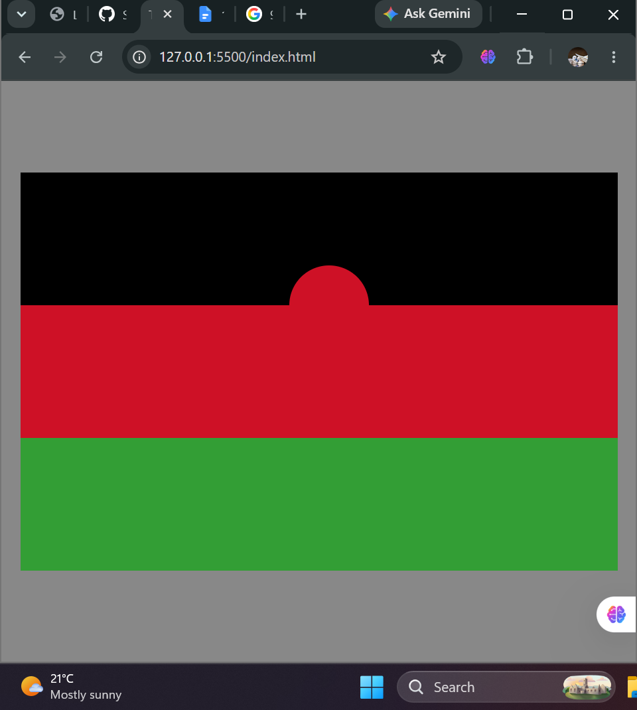

# Lab 3 — Error Log
Student Name: Doreen Providence Abel
Student ID: BECE/21/SS/001
Date: 16 August 2026
Lab Session: 2:00am to 4:00am then 3:30pm to 4:30pm

Error 1
Task I was working on: Task 1 — Cascade & Specificity

**What I was trying to do:**
Predict the colour of each of the four test paragraphs before running the CSS, based on the specificity rules (plain `p`, `.intro`, `#hero`, and both class+id combined).

**The exact error or problem I saw:**
I predicted four different colours (purple, blue, red, green) for the four paragraphs, but every single paragraph rendered purple instead.

**Steps I took to fix it:**
1. Re-read the CSS rules and noticed the last rule used `!important` on the plain `p` selector.
2. Realised `!important` overrides normal specificity entirely, regardless of IDs or classes on the element.
3. Corrected my understanding: with `!important` present, specificity comparison between the other rules becomes irrelevant.

**What I learned from this:**
`!important` isn't just "very specific" — it bypasses the specificity system altogether, which is exactly why the lab describes it as the "nuclear option" to avoid.

## Error 2
**Task I was working on:** Task 2 — Combining Selectors

**What I was trying to do:**
Style navigation links using descendant/child selectors (`nav li`, `nav > ul`) as instructed in step 3.

**The exact error or problem I saw:**
I hadn't actually built a real `<nav><ul><li>` structure — I had added the links as plain paragraphs instead. My CSS rules produced no visible change at all, and I couldn't figure out why.

**Steps I took to fix it:**
1. Searched online for guidance on nav/list selector structure.
2. Learned that descendant/child selectors only work if the matching HTML elements (`nav`, `ul`, `li`) actually exist in the markup.
3. Rebuilt the HTML using a proper `<nav><ul><li>` structure and reran the CSS.

**What I learned from this:**
CSS selectors can't style elements that don't exist — the HTML structure has to match what the selector is looking for, or the rule silently does nothing (no error message, just no effect).

## Error 3
**Task I was working on:** Task 5 — Mini-Project (Flag of Malawi)

**What I was trying to do:**
Centre the sun inside the black band using `top: 50%; left: 50%;`.

**The exact error or problem I saw:**
`top: 50%; left: 50%;` alone did not centre the sun — it sat off-center, shifted toward the bottom-right.

**Steps I took to fix it:**
1. Tried adjusting the top/left percentages manually by trial and error.
2. Landed on `top: 70%; left: 45%;` as a rough visual fix.
3. Later understood the real cause: `top/left: 50%` only moves the element's corner to the center — the missing piece was `transform: translate(-50%, -50%)` to pull it back by half its own size.

**What I learned from this:**
Percentage-based `top`/`left` positions the element's corner, not its middle — true centering needs the `transform: translate(-50%, -50%)` pairing, not manual percentage guessing.

---

## Session Reflection

**The concept I found hardest to understand today:**
The relationship between `position: absolute` and its positioned ancestor — understanding that an absolutely positioned element searches up the DOM tree for the nearest ancestor with a non-static position, and falls back to the whole page if none exists.

**The moment it clicked (if it did):**
Understanding `display: flex`'s default row behaviour — seeing my nav list items line up horizontally instead of stacking, and realising this was flex's default `flex-direction: row`, not a mistake.

**One question I still have:**
Why does `position: absolute` require a parent to have `position: relative` in order to work as expected, and what exactly happens, step by step, when that parent positioning is missing?

My browser output screenshot  